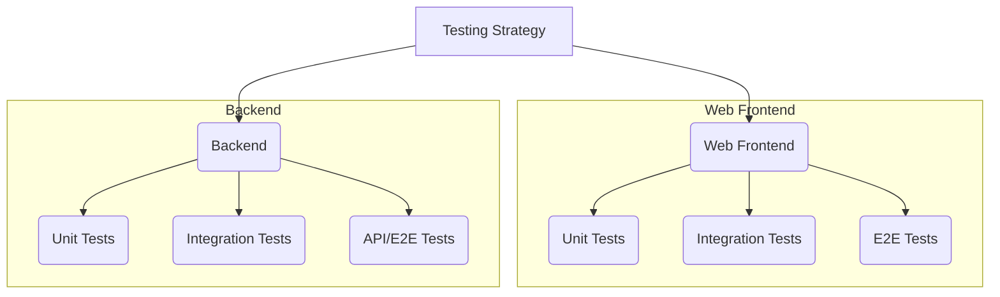

# Testing Strategy Plan for MERN Application

This document outlines the testing strategy for the MERN stack application, covering Unit, Integration, and End-to-End (E2E) tests for both the Web Frontend and the Backend. The approach follows the testing pyramid concept.

## I. Web Frontend Testing (React)

### 1. Unit Tests

*   **Scope:** Individual React components, utility functions, hooks, or state management logic (e.g., Redux reducers/actions, Zustand stores) in isolation.
*   **Goals:** Verify that each small piece works correctly on its own, handling different props, states, and user interactions (simulated). Ensure rendering logic and internal functions behave as expected.
*   **Frameworks/Tools:**
    *   **Jest:** Test runner, assertion library, and mocking capabilities.
    *   **React Testing Library (RTL):** Encourages testing components the way users interact with them.
    *   **Vitest:** Modern alternative to Jest (especially for Vite projects).
*   **Best Practices:**
    *   **Isolation:** Test components without rendering child components deeply or mock dependencies.
    *   **Mocking:** Use `jest.fn()`, `jest.mock()` for API calls, libraries, etc.
    *   **User-Centric Queries:** Use RTL's `getByRole`, `getByLabelText`, `getByText`. Avoid implementation details.
    *   **Event Simulation:** Use RTL's `fireEvent` or `user-event` library.
*   **Organization:** Co-locate test files (`Component.test.jsx`) or use `Tesztesetek/Web/unit/`.
*   **CI/CD:** Run automatically on every commit/PR (e.g., GitHub Actions).
*   **Execution:** Locally during development, and in CI.
*   **Maintenance:** Keep tests focused. Refactor/delete tests as code changes.

### 2. Integration Tests

*   **Scope:** Interactions between multiple components, routing, state management integration, or components interacting with mocked service layers.
*   **Goals:** Verify data flow, shared state effects, navigation, and multi-component interactions.
*   **Frameworks/Tools:** Jest + RTL. Mock Service Worker (MSW) for network-level mocking.
*   **Best Practices:**
    *   **Render Compositions:** Test parent components orchestrating children.
    *   **Mock Boundaries:** Mock API calls/external services at the boundary (MSW or service module mocks).
    *   **Realistic Scenarios:** Test user flows involving multiple components.
*   **Organization:** Within `Tesztesetek/Web/integration/` or using conventions like `*.integration.test.jsx`.
*   **CI/CD:** Run alongside unit tests.
*   **Execution:** Locally and in CI.
*   **Maintenance:** Update when flows or compositions change.

### 3. End-to-End (E2E) Tests

*   **Scope:** Complete user flows through the application in a browser, interacting with a real or staged backend.
*   **Goals:** Verify critical user journeys (login, core features) and frontend/backend integration.
*   **Frameworks/Tools:**
    *   **Cypress:** Popular, runs in-browser, great debugging.
    *   **Playwright:** Cross-browser, supports multiple languages.
    *   **Selenium:** Older standard, powerful but complex.
*   **Best Practices:**
    *   **Stable Selectors:** Use `data-testid`, roles, or user-visible text. Avoid volatile selectors.
    *   **Page Object Model (POM):** Abstract page elements/interactions into reusable objects.
    *   **Data Setup/Teardown:** Ensure consistent state via API seeding/cleanup or dedicated test data.
    *   **Avoid Arbitrary Waits:** Use built-in retry mechanisms and assertions.
    *   **Focus on Critical Paths:** Prioritize key user flows.
*   **Organization:** Separate directory like `Tesztesetek/Web/e2e/` or a root `cypress/` folder.
*   **CI/CD:** Run less frequently (e.g., on merge, pre-deploy) against a staging environment.
*   **Execution:** Locally (requires running app) and in CI (often using Docker).
*   **Maintenance:** Highest cost. Requires effort to keep reliable.

## II. Backend Testing (Node.js/Express/MongoDB)

### 1. Unit Tests

*   **Scope:** Individual functions, modules, controllers (logic), models (custom methods), services in isolation.
*   **Goals:** Verify logic within a single unit, independent of DBs, external APIs.
*   **Frameworks/Tools:**
    *   **Jest:** Popular runner, assertions, mocking.
    *   **Mocha + Chai:** Alternative runner and assertion library.
    *   **Sinon.JS:** Spies, stubs, mocks (often with Mocha/Chai).
*   **Best Practices:**
    *   **Isolation:** Mock database calls (e.g., Mongoose models), external APIs, other modules.
    *   **Dependency Injection:** Design for easy injection of dependencies.
    *   **Focus on Logic:** Test algorithms, data transformations, conditions, error handling.
*   **Organization:** Co-locate (`*.test.js`) or use `Tesztesetek/Backend/unit/`.
*   **CI/CD:** Run on every commit/PR.
*   **Execution:** Locally and in CI.
*   **Maintenance:** Relatively low if units are focused.

### 2. Integration Tests

*   **Scope:** Interactions between backend modules, often involving a test database. Controllers + middleware, services + models/DB.
*   **Goals:** Verify backend parts work together: DB interactions, middleware, service logic.
*   **Frameworks/Tools:** Jest or Mocha/Chai. **Supertest** for HTTP requests to the app instance. Test database (separate MongoDB instance or `mongodb-memory-server`).
*   **Best Practices:**
    *   **Test Database:** Use a dedicated, resettable database for tests.
    *   **Data Seeding/Cleanup:** Programmatically manage test data (`beforeEach`, `afterEach`).
    *   **Test API Endpoints:** Use Supertest to simulate requests and verify responses.
    *   **Mock External Services:** Mock third-party API calls.
*   **Organization:** Dedicated directory like `Tesztesetek/Backend/integration/`.
*   **CI/CD:** Run after unit tests. Requires test DB setup in CI.
*   **Execution:** Locally (requires test DB) and in CI.
*   **Maintenance:** Higher cost due to DB state management.

### 3. API / E2E Tests (Backend Focus)

*   **Scope:** Testing deployed/running backend API endpoints as a black box.
*   **Goals:** Verify API contract (requests, responses, status codes, auth) and end-to-end business logic via API calls.
*   **Frameworks/Tools:**
    *   **Supertest:** Against a running instance.
    *   **Postman/Newman:** Run Postman collections in CI.
    *   **Jest/Mocha + HTTP Client:** Use `axios` or `node-fetch`.
*   **Best Practices:**
    *   **Test API Contracts:** Verify schemas, headers, status codes strictly.
    *   **Authentication/Authorization:** Test with valid/invalid credentials, roles.
    *   **Data Management:** Similar needs as integration tests (seeding/cleanup).
    *   **Focus on Business Flows:** Test sequences of API calls representing user actions.
*   **Organization:** Separate suite, e.g., `Tesztesetek/Backend/api/` or `Tesztesetek/Backend/e2e/`.
*   **CI/CD:** Run against a staging environment or dynamic instance in CI.
*   **Execution:** Locally (requires running backend/DB) and in CI.
*   **Maintenance:** Can be brittle if contracts change. Requires data management.